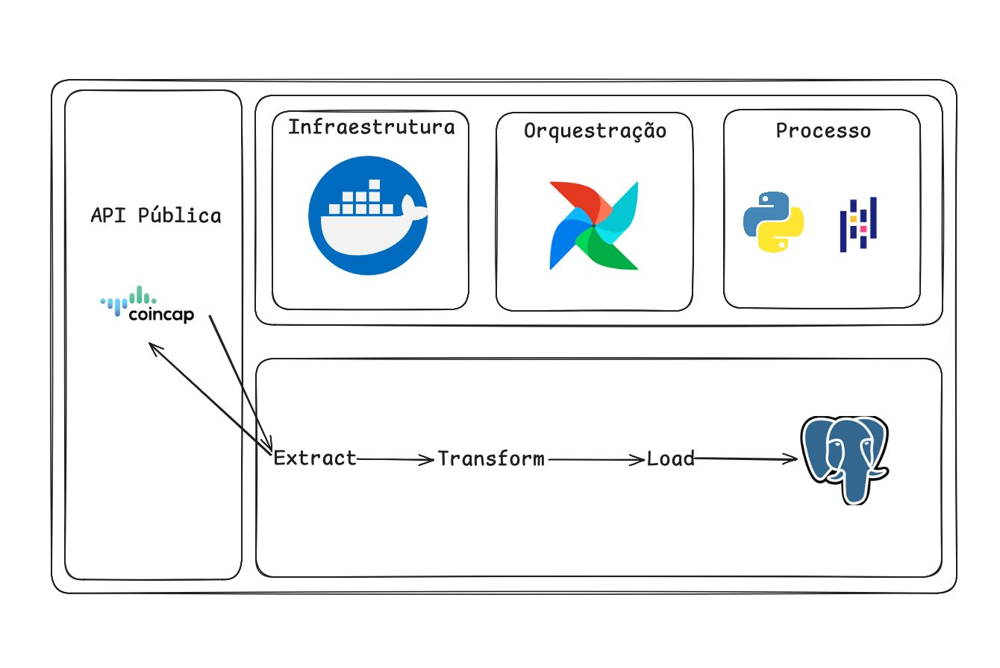

# Containerized Crypto Data Pipeline (ETL)

Pipeline de dados de criptomoedas utilizando Python e Docker para ingestão, processamento e estruturação de dados de mercado em um ambiente containerizado.

Este projeto tem como objetivo construir um pipeline de dados simples e funcional para coleta e processamento de informações de criptomoedas utilizando a API pública CoinCap.

O pipeline realiza extração de dados, transformação com Python (Pandas) e execução em ambiente isolado com Docker, garantindo portabilidade e reprodutibilidade.

### Fluxo do Pipeline:

Este projeto foi desenvolvido como parte dos meus estudos em Engenharia de Dados, com o objetivo de simular um pipeline real de ingestão e processamento de dados.

A ideia foi construir um fluxo simples, mas completo, utilizando dados de criptomoedas via API pública (CoinCap).

Durante o desenvolvimento, foquei em:

- Consumo de API REST
- Processamento e limpeza de dados com Python
- Estruturação de um pipeline ETL
- Containerização da aplicação com Docker

O resultado foi um pipeline funcional, portátil e pronto para evolução para ambientes em nuvem.

Este projeto foi desenvolvido com foco em:

- Entender fluxo de ETL na prática
- Trabalhar com APIs reais
- Estruturar pipelines de dados
- Introdução a containerização com Docker